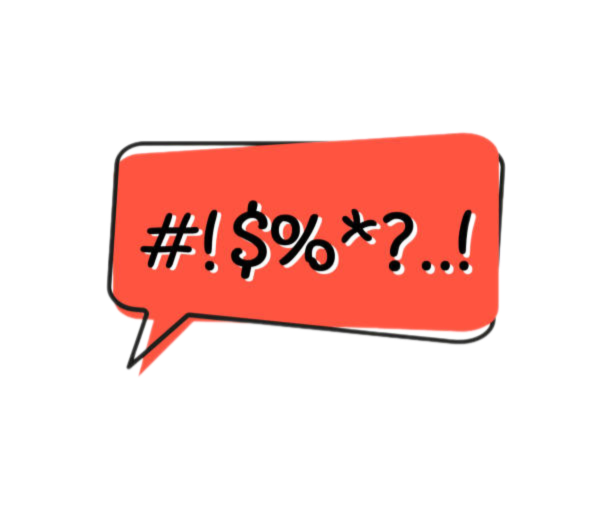

    

# Bad Words List (ID & EN)

This repository contains a list of commonly used bad words. The purpose of this repository is to provide a resource for developers who need to filter or moderate user-generated content in their applications.

## Contributing

If you'd like to contribute to this list by adding more bad words or suggesting improvements. Please create Pull Request.
